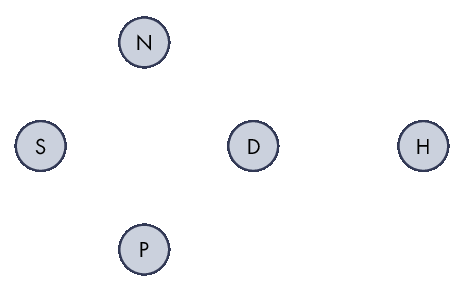
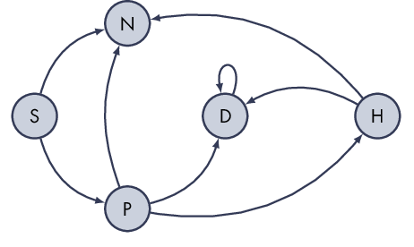

# Modeling-and-Simulation-Project
Project for the Modeling and Simulation class at [UNAM Campus ENES Morelia](https://www.enesmorelia.unam.mx/) 

This project will be based upon a **Probabilistic Model** using Python3

The roles assigned in this project are:

+ Project Leader: [Jazmín López Chacón](https://github.com/tipicanerd)
+ Tech Leader: [Ibeth Escobedo Rios](https://github.com/IbtIbeth/)
+ Public Relations: [Luis David Huante](https://github.com/LuisDHuante)

# Description

Named after the Russian mathematician Andrey Markov, a Markov chain is a special type of discrete stochastic process in which the probability of an event occurring depends only on the immediately preceding event. This is also known as Markov model. 

Markov chains have numerous applications in Bayesian insights, thermodynamics, chemistry, economics, finance, signal processing, information theory and speech processing. For example, for neural networks, they serve in Boltzmann machines. In genetics, Markov chains are used to describe the change in gene frequencies in a small population.

In the same way, Markov analysis, allows finding the probability that a system is in a particular state at a given time. More importantly, it allows you to find the long-term average or steady-state probabilities for each state. With this information, the behavior of the system can be predicted over time. The hardest task is recognizing when it can be applied. The most important feature to look for in memory from one event to another.

# Project approach

The project is focused on the use of a probabilistic model using Python 3 using data concerning the COVID-19 pandemic. Data from different countries will be used to compare and obtain informative conclusions on these data.

## Why did we do this project?

The SARS-Cov-2 coronavirus is a virus that appeared in China. Later it spread to all the continents of the world causing a pandemic. Currently Europe and America are the most affected.

This new virus causes the disease known as COVID-19.

We are in a unique moment in the history of humanity because we are facing a pandemic, this disease has affected millions of people around the world, so this is the best time to observe their behavior. As a Mexican team, we are going to focus on data from Mexico to look at the problem from a more centralized point of view.

From January 1 to August 3, 2021, one million 433 thousand 123 people tested positive for COVID-19 in Mexico, according to the open data of COVID-19 cases from the SSa. Of these, 92,371 (6.45 percent) had been vaccinated against the disease.

## Objectives
The main objective is to model the behaviour of COVID-19 pandemic in Mexico considering the effect that the vaccination campaign. 
### Time and space
The data we will be using is located in Mexico and covers from January 2021 to September 2021.
### Model
We will use **Markov Chains** for modelling.

## Hypothesis
The objective of the project consists of looking for revealing information concerning the vaccination data obtained by the COVID-19 pandemic from different national sources. Different computational and mathematical methods, such as Markov chains, will be used to achieve these results and perform a probability-based model to obtain revealing information.

# Architecture
The architecture of the model will be a **Markov Chain**. The current architecture is the first version, it might be modified in future  realeses
## States
To create a proper Markov Chain, first we need to define our states, after checking up the data, we can consider the next states:
* Symptomatic (S) This state is for anyone who presents COVID-19 symptoms.
* Negative (N) The person with symptoms doesn't has COVID-19.
* Positive (P) This state represents anyone that is infected with the virus SARs-CoV-2.
* Hospitalised (H) This state represents anyone who has COVID-19 and as result is hispitalised.
* Dead (D) THis stae represents people who died from COVID-19.

## Transictions
We have our set of states 

Now we just need to define our transictions to create the base for our Markov Chain, in this case, the transictions are presented in the next graph.

After a first analysis, we get these probabilities:

# Dataset
For this project we will be using a partial dataset from [Secretaría de Salud](https://datos.gob.mx/busca/dataset/informacion-referente-a-casos-covid-19-en-mexico/resource/477a3ac2-3f40-4c78-8b7f-f3615144bc26), this dataset is available [here](https://mega.nz/file/v0clEQSA#E27P6xbheE5z0Jf-4g4oOpnYLZFWfkMew95DIa3hsgA)

# Results
The expected results are 
* A complete Markov chain that describes the pandemic.
* Contagion, hospitalisation and death rate.
* Plots that show the progress of the pandemic. 
